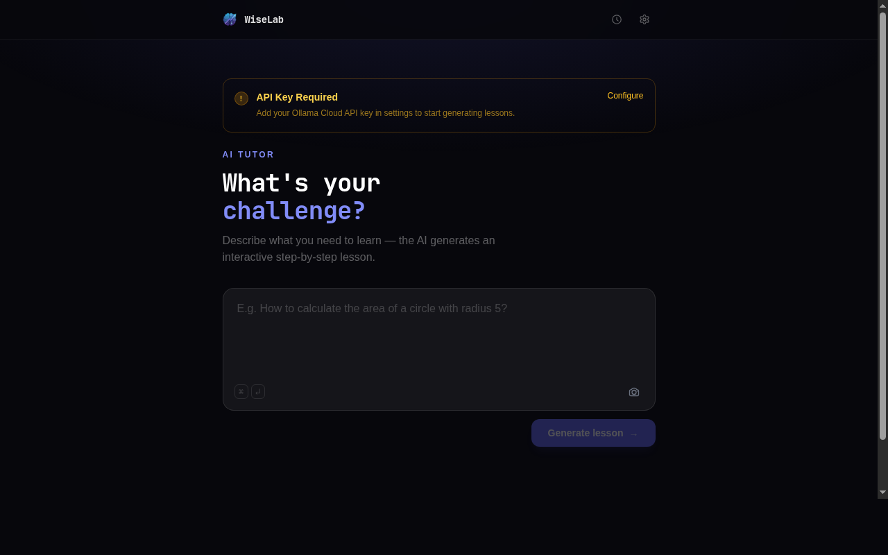

# WiseLab

An AI-powered tutoring app that turns any math or science problem into an interactive, step-by-step lesson. Type a problem or photograph an exercise sheet — WiseLab generates a structured lesson with explanations, LaTeX-rendered formulas, and inline challenges.



---

## Features

- **Text or image input** — type a problem or upload one or more photos of exercise sheets; drag-and-drop supported
- **Multi-image OCR** — multiple images are processed in parallel via a vision model; extracted text is combined into a single lesson
- **Structured lessons** — AI returns 3–6 sequential steps, each with an explanation, optional LaTeX formula, ASCII visual, and a tip
- **Inline challenges** — multiple-choice questions placed every 3–4 steps; must be answered before the next step unlocks
- **"Simplify for me"** — on-demand plain-language analogy for any step
- **"I'm confused" assistant** — conversational hint system that guides the student without revealing the answer
- **Final answer + real-world application** — shown after all steps are completed
- **Lesson history** — past lessons persisted to `localStorage`, restorable from the history drawer
- **Export** — copy or download any lesson as a plain-text file
- **Multi-language** — lessons generated in PT, EN, ES, FR, or DE (configurable in Settings)
- **Difficulty levels** — beginner / intermediate / advanced; affects vocabulary and depth of explanations
- **Runtime API key** — entered once in the Settings drawer and stored in `localStorage`; never baked into the bundle

---

## Tech Stack

| Layer | Technology |
|---|---|
| Framework | React 19 |
| Build tool | Vite 7 |
| Styling | Tailwind CSS 3 |
| Math rendering | KaTeX |
| Icons | Lucide React |
| UI primitives | Radix UI (Dialog, Label, Slot) |
| Lesson model | Ollama Cloud — `gemini-3-flash-preview:cloud` (default) |
| Vision / OCR model | Ollama Cloud — `ministral-3:3b-cloud` (fixed) |
| API protocol | OpenAI-compatible (`/v1/chat/completions`) |
| Persistence | `localStorage` only — no backend, no database |

No router, no global state library — all state is local React hooks and `localStorage`.

---

## Getting Started

### Prerequisites

- Node.js 20+
- An [Ollama Cloud](https://ollama.com) account and API key

### Install

```bash
git clone https://github.com/your-org/wiselab.git
cd wiselab
npm install
```

### Configure environment

```bash
cp .env .env.local
# edit .env.local if you want to override the default lesson model
```

The **API key is not an environment variable**. Each user enters it at runtime through the Settings drawer (gear icon in the header). It is stored in `localStorage` under `wiselab_api_key`. This means the built bundle contains no credentials.

### Run the dev server

```bash
npm run dev
# http://localhost:5173
```

The Vite dev server proxies `/api/v1/*` to `https://api.ollama.ai/v1/` to avoid CORS issues in development.

### Build for production

```bash
npm run build      # outputs to dist/
npm run preview    # serve the production build locally
```

For production deployments you need a server-side proxy that forwards `/api/v1/*` to `https://api.ollama.ai/v1/` and injects the `Authorization` header, **or** you configure a CORS-permissive upstream. The Vite proxy is development-only.

---

## Environment Variables

| Variable | Required | Default | Description |
|---|---|---|---|
| `VITE_OLLAMA_MODEL` | No | `gemini-3-flash-preview:cloud` | Ollama Cloud model identifier used for lesson generation. |

The vision/OCR model (`ministral-3:3b-cloud`) is hardcoded in `src/lib/vision.js` and is not configurable via environment variable.

> Variables prefixed with `VITE_` are inlined into the browser bundle at build time by Vite. Do not store secrets here — use the runtime Settings drawer for the API key.

---

## How It Works

```
User input (text or images)
        |
        v
  [ProblemInput]
  - Text path  → passes raw string to generateLesson()
  - Image path → each file sent to extractTextFromImage()
                 (ministral-3:3b-cloud vision model, parallel)
                 extracted texts joined with "---" separators
        |
        v
  [generateLesson()] — src/lib/ollama.js
  - Builds a system prompt with language + difficulty settings
  - Streams the response via SSE, accumulates raw JSON
  - Strips markdown code fences (``` blocks) if present
  - Applies repairJson(): fixes bare LaTeX backslashes
    and literal newlines embedded inside JSON string values
  - Validates lesson structure and sanitises challenge objects
        |
        v
  [useLesson hook] — step-progression state machine
  - activeStep, completedSteps, canProceed, showAnswer
  - Challenges must be answered correctly before advancing
        |
        v
  [LessonView] — renders the lesson progressively
  - StepCard: explanation + KaTeX formula + ASCII visual + tip
  - ChallengeCard: multiple-choice question with feedback
  - FinalAnswer: answer + real-world application + export actions
```

---

## Project Structure

```
src/
  App.jsx                   root component — layout, state wiring, drawers
  lib/
    ollama.js               generateLesson(), simplifyExplanation(),
                            askConfusedHelp(); settings/API key helpers;
                            repairJson() character-level JSON fixer
    vision.js               extractTextFromImage() via vision model
    exportLesson.js         copyLesson() / downloadLesson() as plain text
    imageUtils.js           validateImageFile(), fileToBase64()
  hooks/
    useLesson.js            lesson state machine (steps, challenges, progress)
    useHistory.js           localStorage lesson history (read/save/delete)
    useApiKey.js            API key read/write from localStorage
  components/
    ProblemInput.jsx        text + multi-image input, drag-and-drop, camera
    LessonView.jsx          step orchestration, skeleton loading states
    StepCard.jsx            single step (locked / active / completed)
    ChallengeCard.jsx       multiple-choice challenge with answer feedback
    FinalAnswer.jsx         final answer, real-world section, export buttons
    MathText.jsx            inline KaTeX renderer — parses $...$ in strings
    HistoryDrawer.jsx       slide-in past lessons panel
    SettingsDrawer.jsx      language, difficulty, and API key configuration
    SubjectSelector.jsx     subject picker; exports getAccentClasses()
  i18n/
    index.jsx               i18n context provider and useI18n() hook
    locales/                pt.js  en.js  es.js  fr.js  de.js
  styles/
    index.css               Tailwind directives, shimmer keyframe, body gradient
```

---

## Lesson JSON Schema

The AI is instructed to return strict JSON. `generateLesson()` validates the parsed object against this shape:

```json
{
  "title": "string",
  "steps": [
    {
      "title": "string",
      "explanation": "string  (inline math wrapped in $...$)",
      "formula": "string (raw LaTeX, no $ delimiters) | null",
      "visual": "string (ASCII diagram or table) | null",
      "tip": "string | null",
      "challenge": {
        "type": "multiple_choice",
        "question": "string",
        "options": ["string", "string", "string", "string"],
        "correct": 0
      } | null
    }
  ],
  "final_answer": "string",
  "real_world": "string"
}
```

---

## Scripts

| Command | Description |
|---|---|
| `npm run dev` | Start dev server at `localhost:5173` |
| `npm run build` | Production build to `dist/` |
| `npm run preview` | Serve the production build locally |
| `npm run lint` | Run ESLint |

---

## Contributing

1. Fork the repository
2. Create a feature branch: `git checkout -b feat/your-feature`
3. Commit: `git commit -m 'feat: describe your change'`
4. Push and open a pull request

Run `npm run lint && npm run build` before submitting to verify nothing is broken.

---

## License

MIT
